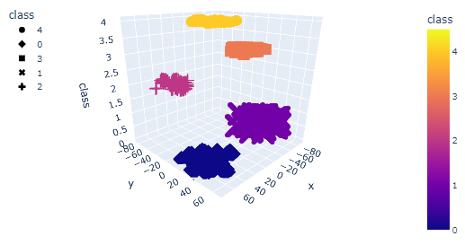

# Myopia Clustering Analysis

This project aims to analyze the myopia patient data using unsupervised machine learning techniques, such as PCA and clustering algorithms, to identify potential clusters of patients that share similar characteristics.

## Requirements

To run this code, you will need the following Python libraries:

* pandas
* pathlib
* scikit-learn
* matplotlib
* plotly
* numpy
* hvplot

## Usage

1. Download the `myopia.csv` dataset and place it in the `Resources` folder.
2. Run the provided code in  to perform data preprocessing, dimensionality reduction, and clustering analysis.

## Overview

The code is structured in three parts:

### Part 1: Prepare the Data

* Reads the dataset and removes the "MYOPIC" column.
* Standardizes the dataset so that all features have the same scale.

### Part 2: Apply Dimensionality Reduction

Applies PCA to reduce the dimensionality of the dataset, while preserving 90% of the explained variance.

Transforms the dataset using t-SNE for better visualization.

### Part 3: Perform a Cluster Analysis with K-means

* Calculates the optimal number of clusters using the elbow method and silhouette scores.
* Performs K-means clustering with the optimal number of clusters.
* Visualizes the resulting clusters in 2D and 3D plots.
  

  

## Conclusion

Based on the fine-tuned t-SNE model and the silhouette score analysis conducted on the elbow_data, it is recommended to group the patients into 5 clusters.
