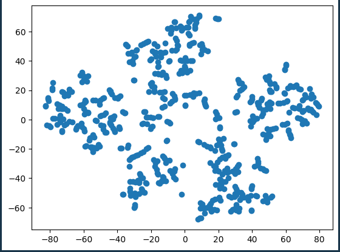
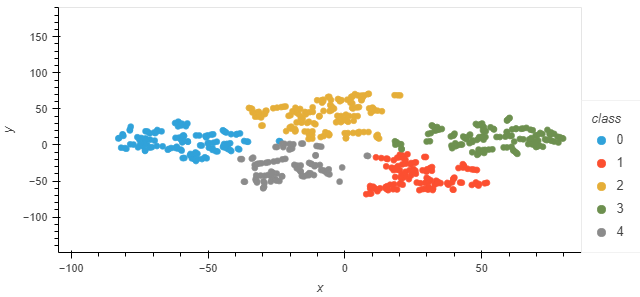

# unsupervised-machine-learning-challenge

#### Part 1: Prepare the Data

1. Read `myopia.csv` into a Pandas DataFrame.
   * **Note:** This file can be found in your Module 20 Challenge files.
2. Remove the "MYOPIC" column from the dataset.
   * **Note:** The target column is needed for supervised machine learning, but it will make an unsupervised model biased. After all, the target column is effectively providing clusters already!
3. Standardize your dataset so that columns that contain larger values do not influence the outcome more than columns with smaller values.

#### Part 2: Apply Dimensionality Reduction

1. Perform dimensionality reduction with PCA. How did the number of the features change?
2. Further reduce the dataset dimensions with t-SNE and visually inspect the results. To do this, run t-SNE on the principal components, which is the output of the PCA transformation.
3. Create a scatter plot of the t-SNE output. Are there distinct clusters?

   

   

#### Part 3: Perform a Cluster Analysis with K-means

Create an elbow plot to identify the best number of clusters. Make sure to do the following:

* Use a `for` loop to determine the inertia for each `k` between 1 through 10.
* If possible, determine where the elbow of the plot is, and at which value of `k` it appears.

#### Part 4: Make a Recommendation

Based on your findings, write up a brief (one or two sentences) recommendation for your supervisor in your Jupyter Notebook. Can the patients be clustered? If so, into how many clusters?
